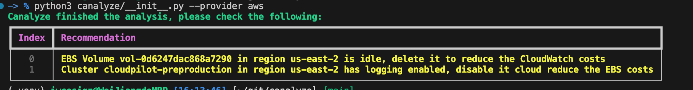

# canalyze
A cloud analysis tool designed to identify opportunities for cost savings in your cloud infrastructure.

## How it looks like

If you run the command `canalyze --provider aws --region us-east-2`, you will get the results:

Then you can follow the instructions to reduce the cloud costs.