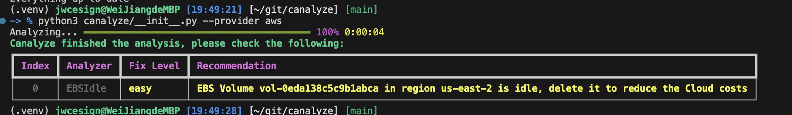

# canalyze  

**A cloud analysis tool designed to help you identify cost-saving opportunities in your cloud infrastructure.**  

## How It Works  

Run the command:  
```bash
canalyze --provider aws --region us-east-2
```  

This will generate results like the following:  

  

Follow the provided recommendations to optimize your cloud setup and reduce costs effectively.

## Installation

TBD