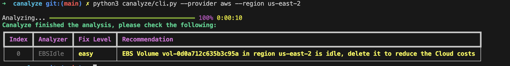

# canalyze  

A cloud analysis tool designed to help you identify cost-saving opportunities in your cloud infrastructure.

## Installation

Currently, `canalyze` is not packaged for installation with a single command. However, you can try it out by following these steps:

```bash
git clone https://github.com/jwcesign/canalyze.git
cd canalyze
python3 -m pip install -r requirements.txt
python3 canalyze/cli.py --provider aws --region us-east-2
```

## How It Works  

Run the command:  
```bash
python3 canalyze/cli.py --provider aws --region us-east-2
```  

This will generate results like the following:  

  

Follow the provided recommendations to optimize your cloud setup and reduce costs effectively.

## License

This project is released under the [Apache 2.0 License](LICENSE).