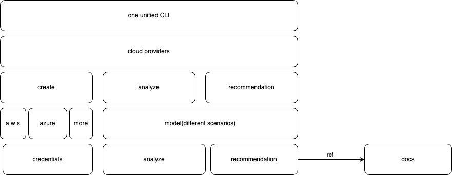

# Background

In the process of using public cloud services, unnecessary costs often arise due to misconfigurations or forgotten resources that remain undeleted. Having an open-source tool that can periodically scan and perform automated operations could significantly reduce such unnecessary expenses.

This tool must be open-source to encourage contributions from the community, allowing others to integrate their specific use cases into the project. Relying solely on our own efforts would make it challenging to address all possible scenarios.

While searching GitHub for similar tools, I found most are outdated or incomplete. Thus, I aim to create a new one.

# Use Cases

The design focuses on three main areas: detection, recommendation, and automation. For now, automation is excluded due to its high complexity and uncertainties.

#### Detection Use Cases:
- Identifying unnecessary misconfigurations that lead to increased costs.
- Detecting idle resources that have been forgotten and continue to incur charges.

#### Recommendation Use Cases:
- Some operations cannot be automated and can only be addressed with suggestions. For example, multiple services exposing themselves through different load balancers could instead consolidate into a single load balancer to save costs.

# Design

This tool primarily targets DevOps engineers. To make it accessible and encourage participation, the project will be developed in Python, a language known for its simplicity and ease of learning.

Given the complexity of operations, the initial focus will be on **analysis** and **recommendation**. The overall architecture is as follows:

Based on this architecture, we can implement different layers of abstraction as needed.
